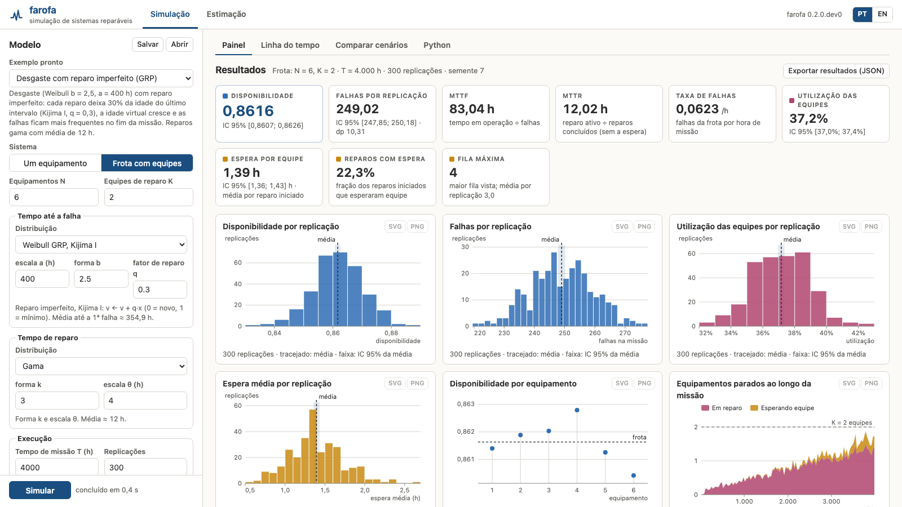

# farofa

**F**ailure **A**nd **R**epair simulation **O**ptimization **F**r**A**mework

A Python framework for Monte Carlo simulation of repairable systems, with focus on reliability analysis. farofa enables modeling devices subject to failure and repair processes using common lifetime distributions, including imperfect repair models such as the Generalized Renewal Process (GRP).

> **Status:** Early development (pre-release). The API is unstable and subject to change.

## Features

- **Single-device failure-repair simulation** with configurable failure and repair time distributions
- **Fleet simulation** with `n` identical devices sharing `k` maintenance teams (FIFO queue)
- **Lifetime distributions:** Exponential, Weibull (perfect repair), Weibull with minimal repair, Weibull GRP (Kijima Type I and Type II), Lognormal, Normal, Gamma
- **Custom user-defined distributions** via callable factories
- **Monte Carlo replication** for statistical analysis (failures, availability, MTTF, MTTR, utilization, queue/wait metrics)
- **Reproducible by construction:** `simulate(seed=...)` gives bit-for-bit repeatable runs (same environment), with provably independent per-device PCG64 streams via `numpy.random.SeedSequence`
- **Vectorized random variate generation** (buffered batch draws through NumPy's PCG64 generator)
- **Parameter estimation from failure records:** power-law NHPP (Crow-AMSAA), Weibull GRP (Kijima I/II) by maximum likelihood, and the Laplace trend test, with fits that plug straight into a simulation
- **Graphical interface** (`farofa gui`): build a model, run it and explore the results in the browser without writing code; works offline, in Portuguese or English

## Installation

```bash
git clone https://github.com/jmateusms/farofa.git
cd farofa
pip install -e .
```

## Graphical interface

```bash
farofa gui              # or: python -m farofa gui
```

This starts a small local server (Python standard library only, no extra
dependencies, no internet access needed) on `http://127.0.0.1:8765/` (or the
next free port) and opens it in the browser. Options: `--port N`,
`--no-browser`, and `--host` (default `127.0.0.1`, this machine only). Stop it
with Ctrl+C. The interface follows the browser language (Portuguese or
English) and has a PT/EN switch in the top bar.



**Simulation.** The model panel on the left builds a single device or a fleet
of N devices sharing K repair teams, with any built-in failure and repair
distribution, mission time, replications, seed and number of traced
replications. Fields are checked by the engine itself, so its messages appear
under the offending field. Ready-made examples load a model in one click, and
*Save*/*Open* keep a scenario as JSON. Long runs show progress and can be
cancelled. The results tabs on the right:

- **Dashboard**: availability, failures per replication, MTTF, MTTR and failure
  rate; for fleets, team utilization, wait for a team, share of repairs that
  waited and maximum queue. Intervals are the library's 95% intervals (one
  observation per replication); the wait interval is a delta-method interval
  of the pooled ratio computed by the interface. Histograms show the outcome
  of every replication, a dot plot the availability of each device, and an
  area chart the mean number of devices waiting or in repair over the mission
  (from the traced replications). With exponential times, the run is checked
  against the exact finite-source queue (Markov chain). *Export results*
  downloads the engine's `to_dict()` plus the scenario.
- **Timeline**: one traced replication as a Gantt chart (up / waiting for a
  team / in repair, failure markers), with queue length and busy teams below.
  Drag across it to zoom, pan with the overview strip, hover for details.
- **Compare scenarios**: varies one parameter (teams K, devices N, mission time
  or any distribution parameter such as q) with the same seed at every point,
  and plots availability, wait, utilization and failures against it with
  intervals; optional costs per team-hour and per device-hour down give the
  cheapest number of teams. Table as CSV or JSON.
- **Python**: the script that reproduces the model with farofa.

**Estimation.** Paste or open failure times (one system, cumulative operating
hours or times between failures, optional end of observation), or load the
USS Halfbeak or USS Grampus records. The view shows the Laplace trend test,
the power law, Weibull GRP Kijima I and II and the Weibull renewal process
with AIC, observed cumulative failures against each fitted mean function (or
against the cumulative intensity given the observed history), the profile
likelihood of q with 95% likelihood-ratio intervals, and the times between
failures. *Use in simulation* sends a fit to the model panel.

Every chart can be saved as SVG or PNG. More screenshots:
[timeline](docs/gui/timeline.png), [team sizing](docs/gui/team-sizing.png),
[exact check](docs/gui/exact-check.png), [Halfbeak estimation](docs/gui/estimation-halfbeak.png)
and [its curves](docs/gui/estimation-curves.png).

## Quick start

### Single device

```python
import farofa

device = farofa.SimpleDevice()
device.set_failure_dist('exponential', 0.0001)  # rate = 0.0001 failures/hour
device.set_repair_dist('exponential', 0.01)      # rate = 0.01 repairs/hour
device.set_mission_time(8760)                     # 1 year in hours

result = device.simulate(reps=10000)
print(result)
```

### Fleet with shared maintenance teams

```python
import farofa

fleet = farofa.Fleet(n_devices=10, n_teams=2)
fleet.set_failure_dist('weibull_grp', 200.0, 1.8, 0.4)  # imperfect repair
fleet.set_repair_dist('lognormal', 2.0, 0.4)
fleet.set_mission_time(8760)

result = fleet.simulate(reps=200)
print(result)
```

### Reproducible runs

Pass `seed=` to `simulate()` to make a run bit-for-bit reproducible (in the
same environment). Each sampler — and each device in a fleet — draws from its
own independent PCG64 stream spawned from the seed, so the random sequence a
device consumes never depends on fleet size (full trajectories are also
identical across fleet sizes when there is no repair queueing, i.e.
`n_teams >= n_devices`):

```python
r1 = device.simulate(reps=10000, seed=42)
r2 = device.simulate(reps=10000, seed=42)
# r1 and r2 are identical, sample by sample
```

Custom distribution factories work too: a plain callable is accepted but sits
outside seed control; implement `set_rng(generator)` (or subclass
`farofa.distributions.Sampler`) to participate in seeding.

### Uncertainty from replications

Availability results expose a normal-approximation confidence interval based
on one outcome per replication:

```python
result.availability_confidence_interval()  # (lower, upper), 95% by default
result.failure_count_confidence_interval() # mean total failures per replication
```

For a fleet, the outcome is the whole fleet's device-hour availability in a
replication, rather than one value per device: shared maintenance teams induce
within-replication dependence. The interval describes Monte Carlo sampling
error only. It does not remove the established `[0, T)` mission-boundary
censoring or model uncertainty; with fewer than two replications it returns
`(nan, nan)`. Fleets also expose `server_utilization_confidence_interval()`;
it uses `busy_team_hours / (n_teams * mission_time)` once per replication.

### Reproducible result export and illustrative sizing

Both result types provide `to_dict()` and `export_json(path)`. The export is a
versioned JSON payload with summary metrics, confidence intervals and the raw
outcome for every replication. Unavailable numerical estimates are exported as
JSON `null` (while the Python API retains `nan`). In fleet outputs, those whole-fleet replication
outcomes are the unit for intervals; per-device rows are diagnostic only.

`examples/illustrative_team_sizing.py` is a runnable synthetic comparison of
one, two and three maintenance teams. It records its seed, replication budget,
finite-horizon convention and all assumptions in
`illustrative_team_sizing_results.json`. Its values are deliberately invented
for a reproducible example and are **not** a real staffing recommendation.

### From failure data to simulation

`farofa.estimation` fits a failure process to the cumulative operating times
at which **one** system failed, observed from new (`t = 0`) until `end_time`
(failure-truncated at the last failure when omitted):

```python
import farofa

times = [...]  # cumulative operating hours at each failure, ascending
u, p = farofa.laplace_trend_test(times, end_time=T)  # u > 0: deterioration
nhpp = farofa.fit_power_law(times, end_time=T)        # minimal repair (q = 1)
grp = farofa.fit_weibull_grp(times, end_time=T)        # Kijima I, q estimated
print(nhpp.b, grp.q, grp.aic, nhpp.aic)

device = farofa.SimpleDevice()
device.set_failure_dist(*grp.distribution())   # ('weibull_grp', a, b, q)
device.set_repair_dist('lognormal', 2.0, 0.4)  # repair times fitted separately
```

The power law has a closed form. For the GRP the scale is profiled out and
the likelihood is maximized over shape and `q` (grid plus golden-section
search, NumPy only); `fit_weibull_grp(..., q=value)` fixes `q`, so a loop over
`q` traces its profile likelihood for interval estimates. `q = 1` reproduces
the power law and `q = 0` a Weibull renewal process. Repair durations do not
enter these likelihoods.

`examples/repairable_data_fit.py` runs the whole path on two published
diesel-engine records (USS Halfbeak, which deteriorates, and USS Grampus,
which shows no trend).

### Event trace and timelines

`simulate(..., trace=k)` records the events of the first `k` replications — `FAILURE`,
`REPAIR_START` (a team takes the device, possibly after queueing) and `REPAIR_DONE` — in
`result.event_log`, a structured array with columns `rep, entity, event, time`. Recording
draws no random numbers, so every metric is identical with or without it.

```python
result = fleet.simulate(reps=1000, seed=42, trace=3)
result.event_log[:5]            # (rep, device, event, time) rows
tl = result.timeline(0)         # (entity, state, start, end); state: up / waiting / repair
```

Counting `waiting` and `repair` intervals over time gives the queue length and the busy
teams; `to_dict()` / `export_json()` include the event log when a trace was recorded.

`simulate(..., progress=f)` calls `f(done, reps)` after every replication (the GUI uses it
for its progress bar and to cancel a run by raising from `f`); like the trace, it draws no
random numbers and changes no result.

## Available distributions

| Distribution | Function | Repair assumption | Parameters |
|---|---|---|---|
| Exponential | `exponential` | Memoryless (perfect repair) | `rate` |
| Weibull | `weibull` | Perfect repair (age reset to 0) | `a` (scale), `b` (shape) |
| Weibull (minimal repair) | `weibull_min` | Minimal repair (age preserved; stateful) | `a` (scale), `b` (shape) |
| Weibull GRP (Kijima I) | `weibull_grp` | Imperfect repair, `v_i = v_{i-1} + q·x_i` (stateful) | `a` (scale), `b` (shape), `q` (repair effectiveness, 0–1) |
| Weibull GRP (Kijima II) | `weibull_grp2` | Imperfect repair, `v_i = q·(v_{i-1} + x_i)` (stateful) | `a` (scale), `b` (shape), `q` (repair effectiveness, 0–1) |
| Lognormal | `lognormal` | — (typically used for repair times) | `mu`, `sigma` (log-scale) |
| Normal (truncated at 0) | `normal` | — (resampled until positive) | `mu`, `sigma` |
| Gamma | `gamma` | — | `shape`, `scale` |

## Roadmap

farofa is being developed incrementally. Below is the planned scope for each milestone.
The versioned current-state plan is [docs/DEVELOPMENT_PLAN.md](docs/DEVELOPMENT_PLAN.md).

### v0 — Single device simulation

Core simulation engine for a single repairable device.

- [x] Failure-repair simulation loop with exponential and Weibull distributions
- [x] Weibull GRP (Generalized Renewal Process) for imperfect repair modeling (Kijima Type I and Type II)
- [x] Reproducible, vectorized random variate generation (PCG64, seeded per-device streams)
- [x] Support for custom (user-defined) lifetime distributions
- [x] Lognormal, Normal, and Gamma distributions
- [x] Output metrics: availability, mean time to failure (MTTF), mean time to repair (MTTR), failure rate
- [x] Results object with summary statistics and raw simulation data
- [x] Input validation and meaningful error messages
- [x] Unit tests
- [x] CI: pytest on supported Python versions

### v1 — Queueing systems (current)

Multiple devices sharing repair resources (maintenance teams).

- [x] Queue with `n` identical devices and `k` repair servers (FIFO)
- [x] Metrics: queue length, waiting time, server utilization
- [ ] Additional queue disciplines (priority-based, custom)
- [ ] Support for custom queue models

### v2 — Heterogeneous systems

Different device types in the same system.

- [ ] Multiple device types with independent failure/repair behavior
- [ ] Priority classes for repair scheduling
- [ ] System-level metrics (e.g., system availability with redundancy)
- [ ] Expanded set of output metrics

### v3 — Optimization

Find optimal maintenance policies and system configurations.

- [ ] Optimization over maintenance parameters (e.g., preventive maintenance interval, number of repair teams)
- [ ] Built-in objective functions: cost, availability, profit
- [ ] Support for custom objective functions
- [ ] Integration with scipy.optimize or similar

### v4 — GUI

Graphical interface for building and running simulations without code.

- [x] Local web interface (`farofa gui`, standard library only, offline): model builder validated by the engine, scenario files, progress and cancel
- [x] Results dashboard with confidence intervals, per-replication histograms, interactive timeline (zoom, hover), queue and busy teams over time, SVG/PNG/JSON export
- [x] Scenario comparison (one-parameter sweeps with common random numbers, cost-based team sizing)
- [x] Estimation view: Laplace test, power-law and GRP fits with AIC, mean functions, profile likelihood of q, fit sent to the simulation
- [x] Portuguese and English
- [ ] Views for heterogeneous systems and optimization (following v2 and v3)

### v5 — Parameter estimation

Estimate distribution parameters from observed failure/repair data.

- [x] Maximum likelihood estimation for repairable-system failure processes (power-law NHPP, Weibull GRP Kijima I/II) and the Laplace trend test
- [ ] Maximum likelihood estimation for the remaining (repair-time) distributions
- [ ] Goodness-of-fit testing
- [ ] Integration with or reference to existing tools (e.g., `reliability` package)

## Background

farofa is inspired by research in reliability engineering, particularly repairable systems modeling with imperfect repair and queueing-based maintenance optimization. Key references:

- Moura, M. C. et al. (2017). Analysis of extended warranties for medical equipment: A Stackelberg game model using priority queues. *Reliability Engineering & System Safety*, 168, 338–354. [DOI](https://doi.org/10.1016/j.ress.2017.05.040)
- Santana, J. M. et al. (2018). Extended warranty of medical equipment subject to imperfect repairs. *Eksploatacja I Niezawodnosc*, 20(4), 567–578. [DOI](https://doi.org/10.17531/ein.2018.4.8)
- Yañez, M. et al. (2002). Generalized renewal process for analysis of repairable systems with limited failure experience. *Reliability Engineering and System Safety*, 77(2), 167–180. [DOI](https://doi.org/10.1016/S0951-8320(02)00044-3)
- Wang, Z. M. & Yang, J. G. (2012). Numerical method for Weibull generalized renewal process and its applications in reliability analysis of NC machine tools. *Computers and Industrial Engineering*. [DOI](https://doi.org/10.1016/j.cie.2012.06.019)
- Moura, M. C. et al. (2014). A competing risk model for dependent and imperfect condition-based preventive and corrective maintenances. *Proceedings of the Institution of Mechanical Engineers Part O*, 228(6), 590–605. [DOI](https://doi.org/10.1177/1748006X14540878)

## License

GNU General Public License v3 — see [LICENSE](LICENSE).
